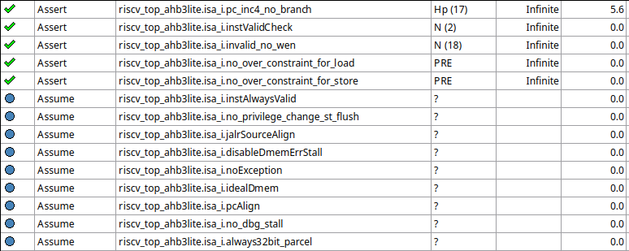

# Introduction

## RV12 architecture
RV12 is a 6-stage pipelined RISCV CPU. In this project, we only verify the correctness of a subset of RV32I instruction set.

 <p class="text-center">
Figure1 : The Microarchitecture of RV12
<p>
    
## End-to-End Verification
    


In this project, we employ an end-to-end method to verify the CPU against the RV32I ISA specification. This means we only perform checks when an instruction enters the write-back (WB) stage, and the instruction is valid (i.e., it is not a dummy instruction caused by a stall or flush).
By adopting this approach, we no longer need to track the detailed logic implemented in each stage; instead, we only need to check whether an instruction is functionally correct based on the decoded result in the write-back (WB) stage and value stored in regfile in the same cycle. 
This method is based on the assumption that the stall and flush control signals in the CPU are correct, which has been verified by manually trace each stage's signals.

# Assumption
We use `assume` keyword to constraint the system to the states we are interested in. (i.e. RV32I inst only, no debug mode, etc.)

Check `isa.tcl` and `property/*.sv` for details.

# Pipeline follower
Due to the lack of a complete spec for RV12, we trust the control signals in the hardware (stall, flush) and the derived control signal (bubble, inst) from these signals to complete the pipeline follower. This assumption is acceptable cause stall and flushes is guaranteed to be correct by manually checking stated above.


 ## Necessary Infomations
To implement the pipeline follower, aside from the instr fetched by the if stage, we need to understand how control signals affect the information at each stage. Since we don't have the RV12 specification, we analyzed how stalls and flushes are generated, determined which can be ignored, and identified the stages affected.
Although our bubbles and instructions will be similar to those in the hardware, we have our own considerations regarding the PC and validity of instructions in each stage, so there will be no confirmation behavior to avoid different roles for these two signals in the hardware.
Below is the information we gathered from the hardware, along with the related signals we used to implement our pipeline follower.

* PC
The Program Counter (PC) directly follows the instruction as it progresses through the pipeline. When an instruction stalls, the PC also stalls. When an instruction moves to the next stage, the PC follows the instruction and advances to the next stage as well.

* Instruction Validity
In our implementation, a valid instruction is one that takes effect in the execute (EXE) stage. After investigating how instructions flow through the pipeline, we conclude the following:

A non-valid instruction caused by a stall or flush is guaranteed to be a bubble in the ID stage. Therefore, we only need to check whether the instruction in the ID stage is not a bubble and that it is a valid RV32I instruction. However, since we assume that the input is always a valid RV32I instruction, we only need to check that the instruction in the ID stage is not a bubble. As a result, for pipeline stage from EXE to MEM, the bubble is the only concerned. However, WB stage is a little different, cause itself will generate bubble for dmem tranction, thus the valid inst signal in wb stage should take wb_stall as consideration:
```verilog
always_ff @(posedge clk) begin
    if (rst) wb_pipeline_info.inst_valid <= 1'b0;
    else if (core_wb_stall) wb_pipeline_info.inst_valid <= 1'b0;
    else wb_pipeline_info.inst_valid <= mem_pipeline_info.inst_valid;
end
```


    
 <p class="text-center">
List : Information we gathered from the hardware
<p>

```verilog
logic [31:0] if_inst;
logic [31:0] if_pc;
assign if_inst = core.if_unit.rv_instr;
always_comb begin
    if (rst) if_pc = PC_INIT;
    else if (core.if_unit.du_we_pc_strb) if_pc = core.if_unit.du_dato_i;
    else if (!core.if_unit.pd_stall_i && !core.if_unit.du_stall_i) begin
        if_pc = core.if_unit.if_nxt_pc_o;
    end else if_pc = core.if_unit.if_pc_o;
end

//flushes core
logic if_flush;
logic pd_flush;
logic id_flush;
logic ex_flush;
logic wb_flush;
logic core_pd_flush;
logic core_bu_flush;
logic core_bu_cacheflush;

//stalls core
logic core_id_stall;
logic core_pd_stall;
logic core_ex_stall;
logic core_mem_stall[2];
logic core_wb_stall;

// stall and flush
always_comb begin
    if_flush = core_pd_flush;
    pd_flush = core_bu_flush;
    id_flush = core_bu_flush;
    ex_flush = core_bu_flush;
    wb_flush = core_bu_flush;
    core_pd_flush = core.pd_flush;
    core_bu_flush = core.bu_flush;
    core_bu_cacheflush = core.bu_cacheflush;

    core_id_stall = core.id_stall;
    core_pd_stall = core.pd_stall;
    core_ex_stall = core.ex_stall;
    core_mem_stall = core.mem_stall;
    core_wb_stall = core.wb_stall;
end
```

 <p class="text-center">
List : Related signals we used to implement our pipeline follower
<p>
    
```verilog
logic id_bubble_cond;
logic id_bubble_r; 
always_comb begin : id_bubble_wire
    id_bubble_cond = core_ex_stall | core_bu_flush;
end

always_ff @(posedge clk) begin
    if (rst) id_bubble_r <= 1;
    else if (core_bu_flush) id_bubble_r <= 1;
    else if (!core_ex_stall) id_bubble_r <= pd_pipeline_info.bubble | core_id_stall;
end
```
  
## Implementation
Below shows the implementation of our pipeline follower.

```verilog
    //pipeline follower
    // imem to if
    always_comb begin
        if_flush = core_pd_flush;  //ignore parcel valid(no compressed inst)
    end
    always_ff @(posedge clk) begin
        if_pipeline_info.inst_valid <= 1'b0;
        if (rst) if_pipeline_info.inst_pc <= {NOP, PC_INIT};
        else if (!core_pd_stall) if_pipeline_info.inst_pc <= {if_inst, if_pc};  //ignore WFI
    end

    always_ff @(posedge clk) begin
        if (rst) if_pipeline_info.bubble <= 1;
        else if (if_flush) if_pipeline_info.bubble <= 1;
        else if (!core_pd_stall) if_pipeline_info.bubble <= core.pd_latch_nxt_pc;  //ignore WFI
    end
    // if to pd
    always_comb begin
        pd_flush = core_bu_flush;  // branch unit /state control
    end
    always_ff @(posedge clk) begin
        pd_pipeline_info.inst_valid <= 1'b0;
        if (rst) pd_pipeline_info.inst_pc <= {NOP, PC_INIT};
        else if (!core_id_stall) pd_pipeline_info.inst_pc <= if_pipeline_info.inst_pc;
    end

    always_ff @(posedge clk) begin
        if (rst) pd_pipeline_info.bubble <= 1;
        else if (pd_flush) pd_pipeline_info.bubble <= 1;
        else if (!core_id_stall) pd_pipeline_info.bubble <= if_pipeline_info.bubble;
    end
    // pd to id
    always_comb begin
        id_flush = core_bu_flush;  // branch unit /state control
    end
    always_comb begin : id_bubble_wire
        id_bubble_cond = core_ex_stall | core_bu_flush;
    end
    always_ff @(posedge clk) begin
        id_pipeline_info.inst_valid <= 1'b0;
        if (rst) id_pipeline_info.inst_pc <= {NOP, PC_INIT};
        else if (!core_ex_stall) id_pipeline_info.inst_pc <= pd_pipeline_info.inst_pc;
    end
    always_ff @(posedge clk) begin
        if (rst) id_bubble_r <= 1;
        else if (core_bu_flush) id_bubble_r <= 1;
        else if (!core_ex_stall) id_bubble_r <= pd_pipeline_info.bubble | core_id_stall;
    end
    always_comb begin
        id_pipeline_info.bubble = id_bubble_r | id_bubble_cond;
    end
    // id to ex
    always_comb begin
        ex_flush = core_bu_flush;  // branch unit /state control
    end
    always_ff @(posedge clk) begin
        if (rst) ex_pipeline_info.inst_pc <= {NOP, PC_INIT};
        else if (!core_ex_stall) ex_pipeline_info.inst_pc <= id_pipeline_info.inst_pc;
    end
    always_comb @(posedge clk) begin
        ex_pipeline_info.bubble = (core.ex_units.alu_bubble) && (core.ex_units.lsu_bubble) &&
            (core.ex_units.mul_bubble) && (core.ex_units.div_bubble);
        // Because we assume that all inst is valid, if last id's inst has no bubble
        // Then it must be valid inst in exe stage
        ex_inst_valid = ~(ex_pipeline_info.bubble & ex_bubble_misc);
        ex_pipeline_info.inst_valid = ex_inst_valid;
    end
    // ex to mem
    always_ff @(posedge clk) begin
        if (rst) begin
            mem_pipeline_info.inst_pc <= {NOP, PC_INIT};
            mem_pipeline_info.inst_valid <= 1'b0;
        end else if (!core_wb_stall) begin
            mem_pipeline_info.inst_pc <= ex_pipeline_info.inst_pc;
            mem_pipeline_info.inst_valid <= ex_pipeline_info.inst_valid;
        end
    end

    always_ff @(posedge clk) begin
        if (rst) mem_pipeline_info.bubble <= 1;
        else if (!core_wb_stall) mem_pipeline_info.bubble <= ex_pipeline_info.bubble;
    end
    // mem to wb
    always_comb begin
        wb_flush = core_bu_flush;  // branch unit /state control
    end
    always_ff @(posedge clk) begin
        if (rst) begin
            wb_pipeline_info.inst_pc <= {NOP, PC_INIT};
        end else if (!core_wb_stall) begin
            wb_pipeline_info.inst_pc <= mem_pipeline_info.inst_pc;
        end
    end

    always_ff @(posedge clk) begin
        if (rst) wb_pipeline_info.inst_valid <= 1'b0;
        else if (core_wb_stall) wb_pipeline_info.inst_valid <= 1'b0;
        else wb_pipeline_info.inst_valid <= mem_pipeline_info.inst_valid;
    end

    always_ff @(posedge clk) begin
        if (rst) wb_pipeline_info.bubble <= 1;
        else if (!core_wb_stall) wb_pipeline_info.bubble <= mem_pipeline_info.bubble;
    end
```
                                                                  

 ## Assertions to verify this pipeline follower
To verify this pipeline follower, we simply check our instrutions and bubbles are same with RV12.
```verilog
property CHECK_PIPE_IF_TO_PD;
    @(posedge clk) disable iff (rst) (if_pipeline_info.inst_pc.inst == core.if_insn.instr) &&
        (if_pipeline_info.bubble == core.if_insn.bubble);
endproperty

property CHECK_PIPE_PD_TO_ID;
    @(posedge clk) disable iff (rst) (pd_pipeline_info.inst_pc.inst == core.pd_insn.instr) &&
        (pd_pipeline_info.bubble == core.pd_insn.bubble);
endproperty

property CHECK_PIPE_ID_TO_EX;
    @(posedge clk) disable iff (rst) (id_pipeline_info.inst_pc.inst == core.id_insn.instr) &&
        (id_pipeline_info.bubble == core.id_insn.bubble);
endproperty

property CHECK_PIPE_EX_TO_MEM;
    @(posedge clk) disable iff (rst) (ex_pipeline_info.inst_pc.inst == core.ex_insn.instr) &&
        (ex_pipeline_info.bubble == core.ex_insn.bubble);
endproperty

property CHECK_PIPE_MEM_TO_WB;
    @(posedge clk) disable iff (rst) (mem_pipeline_info.inst_pc.inst == core.mem_insn[0].instr)
        && (mem_pipeline_info.bubble == core.mem_insn[0].bubble);
endproperty

property CHECK_PIPE_WB_TO_REG;
    @(posedge clk) disable iff (rst) (wb_pipeline_info.inst_pc.inst == core.wb_insn.instr) &&
        (wb_pipeline_info.bubble == core.wb_insn.bubble);
endproperty
```

## Result


# ISA Verifications
To simplify the verification, we decouple the behavior of each instruction. Specifically, we check the write-back data, destination, and write enable at the write-back (WB) stage for all instructions, and we verify that the register file will exhibit correct behavior separately.

 ## Regfile
Register file is a storage in CPU's compute data path. It can be regarded as the state of a CPU. Originally, end to end isa formal should verify the register file every time when instructions update it is correct or not. That is, whenever a valid instruction enter WB stage, the correspond register should be correctly update accroding to the execution result.
However, the massive memory space in register file will significantly increase the complexity in proof progress, so we use divide the prove into 2 steps
- Register File
    - When performing write operation: 
        - The target register will store the correct value in the next cycle
        - The others will retain its original value
    - When performing read operation:
        - The data output ports will reflect the actual value in target registers
- ISA Formal
    - Instead of checking the result into register file, check the result when write enable is high in write back stage.

### Implementation
The assertions related to regfile is listed below:
- write_correct
    - This asserion make sure the target register will be written to the value appears at the write data_in port when write enable is high.
- reg_stable
    - This assertions make sure registers whichever are not the target will not change its content when write enable is high.
- x0_produce_0
    - This assertions make sure register file will give 0 when reading x0
- other_read_correct
    - This assertions make sure we can get the actual content when reading register other than x0.
```verilog
//////////////////// Assertion ////////////////////
property write_correct(logic [31:0] duv_rf, rsd_t rf_dst, logic [4:0] rf_index);
    @(posedge clk) disable iff (rst)
    ~(pd_stall_i | id_stall_i) && (rf_dst == rf_index) && rf_we_i
    |=> ($past(rf_dst_d_i) == duv_rf);
endproperty

property reg_stable(logic [31:0] duv_rf, rsd_t rf_dst, logic [4:0] rf_index);
    @(posedge clk) disable iff (rst)
    ~(pd_stall_i | id_stall_i) && (rf_dst != rf_index) && rf_we_i
    |=> $stable(duv_rf);
endproperty

property x0_produce_0(rsd_t rf_src_i, logic [31:0] rf_src_q_o);
    @(posedge clk) disable iff (rst)
    exist_not_id_stall_when_read_x0(rf_src_i)
    |=> (rf_src_q_o == 32'd0);
endproperty

property other_read_correct(rsd_t rf_src_i, logic [31:0] rf_src_q_o);
    @(posedge clk) disable iff (rst)
    exist_not_id_stall_when_read_others(rf_src_i)
    |=> ( $past(rf[ rf_src_i ]) == rf_src_q_o);
endproperty
```
    
### Result


 ## XORI
For the xori instruction, the specification constrains 
$reg[rd] = reg[src1]$ ^ $imm$ . Since we have verified the register file, we only need to check that the write data, destination, and write enable signals in the WB stage are correct.
    Below shows the implementation of xori verification. `xori_trigger` means there is a valid xori in WB stage,
and `xori_result` is the golden value this instruction should write-back to regfile.
  ### Implementation
```verilog=
logic [31:0] xori_result;
assign xori_result = (wb_rs1) ^ ({20'h0, wb_inst_dc.imm12_i});
logic xori_trigger;
assign xori_trigger = ((wb_inst_dc.opcode == OPC_I) && (wb_inst_dc.funct3 == XORI)) &&
    wb_pipeline_info.inst_valid;

property E2E_XORI_PRE_WB;
    @(posedge clk) disable iff (rst) xori_trigger |-> (core.wb_r == (xori_result));
endproperty : E2E_XORI_PRE_WB

property E2E_XORI_RD;
    @(posedge clk) disable iff (rst) xori_trigger |-> (core.wb_dst == wb_inst_dc.rd);
endproperty : E2E_XORI_RD

property E2E_XORI_WE0;  // rd == 0 -> must disable write;
    @(posedge clk) disable iff (rst) xori_trigger && !(|wb_inst_dc.rd) |-> (!core.wb_we);
endproperty : E2E_XORI_WE0

property E2E_XORI_WE1;  // rd != 0 -> must enable write;
    @(posedge clk) disable iff (rst) xori_trigger && |wb_inst_dc.rd |-> (core.wb_we == 1);
endproperty : E2E_XORI_WE1
```
### Result


## AUIPC
For the auipc instruction, the specification constrains that
$$reg[rd] = pc + 4$$
    Similar to xori, since we have verified the register file, we only need to check that the write data, destination, and write enable signals in the WB stage are correct.
    Below shows the implementation of auipc verification. `auipc_trigger` means there is a valid auipc in WB stage, and `auipc_gold_res` is the golden value this instruction should write-back to regfile.

### Implementation
```verilog
logic auipc_trigger;
logic [31:0] auipc_uimm;
logic [31:0] auipc_gold_res;
assign auipc_uimm = {wb_inst_dc.uimm_20, 12'b0};
assign auipc_gold_res = auipc_uimm + wb_pipeline_info.inst_pc.pc;
assign auipc_trigger = (wb_inst_dc.opcode == OPC_AUIPC) && wb_pipeline_info.inst_valid;
property E2E_AUIPC_PRE_WB;
    @(posedge clk) disable iff (rst) auipc_trigger |-> (core.wb_r == (auipc_gold_res));
endproperty : E2E_AUIPC_PRE_WB

property E2E_AUIPC_RD;
    @(posedge clk) disable iff (rst) auipc_trigger |-> (core.wb_dst == wb_inst_dc.rd);
endproperty : E2E_AUIPC_RD

property E2E_AUIPC_WE0;  // rd == 0 -> must disable write;
    @(posedge clk) disable iff (rst) auipc_trigger && !(|wb_inst_dc.rd) |-> (!core.wb_we);
endproperty : E2E_AUIPC_WE0

property E2E_AUIPC_WE1;  // rd != 0 -> must enable write;
    @(posedge clk) disable iff (rst) auipc_trigger && |wb_inst_dc.rd |-> (core.wb_we == 1);
endproperty : E2E_AUIPC_WE1

// invalid inst should never change reg file
property INVALID_NO_WEN;
    @(posedge clk) disable iff (rst) wb_pipeline_info.inst_valid == 0 |-> core.wb_we == 0;
endproperty : INVALID_NO_WEN
```

### Result


## BLT
For the blt instruction, the specification constrains:
$$next\_pc = (reg[rs1] < reg[rs2])? (pc + imm) : pc$$ 
Since this instruction doesn’t write to the register file, we only check the pc value for the next valid instruction. To find the next valid instruction, we consider two cases. The first case is when the next instruction is valid, and the second case is when the next valid instruction occurs in the near future. We use `blt_followed_by_valid_inst_immediately` and `blt_followed_by_invalid_inst_then_valid` to represent these two cases, respectively.

Furthermore, to verify the coverage, we use goto and intersect the double check.
Below shows our implementation. `blt_trigger` means the instruction in WB is the next valid instruction after a valid blt.
    
### Implementation
```verilog
logic [31:0] blt_non_taken_addr;
logic [31:0] blt_taken_addr;
logic [31:0] blt_gold_addr;
logic blt_taken;
logic had_blt_past;
logic valid_blt;
assign valid_blt = (wb_inst_dc.opcode == OPC_B) && (wb_inst_dc.funct3 == BLT) &&
    wb_pipeline_info.inst_valid;

assign blt_taken = $signed(wb_rs1) < $signed(wb_rs2);
assign blt_non_taken_addr = wb_pipeline_info.inst_pc.pc + 32'd4;
assign blt_taken_addr = wb_pipeline_info.inst_pc.pc +
    {{19{wb_inst_dc.imm13_b[12]}}, wb_inst_dc.imm13_b};
always_ff @(posedge clk) begin
    if (valid_blt) blt_gold_addr <= blt_taken ? blt_taken_addr : blt_non_taken_addr;
end

sequence blt_followed_by_invalid_inst_then_valid;
    valid_blt ##1
    // inst is not valid for 1~$(any numbers) consecutive cycles
    ((wb_pipeline_info.inst_valid == 0) [* 1: $])
    // then one cycle after, there is a valid inst
    ##1 wb_pipeline_info.inst_valid;
endsequence : blt_followed_by_invalid_inst_then_valid

sequence blt_followed_by_valid_inst_immediately;
    valid_blt ##1 wb_pipeline_info.inst_valid == 1;
endsequence : blt_followed_by_valid_inst_immediately

property E2E_BLT;
    @(posedge clk) disable iff (rst) blt_followed_by_invalid_inst_then_valid or
        blt_followed_by_valid_inst_immediately |-> core.wb_pc == blt_gold_addr;
endproperty : E2E_BLT
```
### Result


    
## JAL
For the jal instruction, the specification constrains:
$$next\_pc = (pc + imm)$$
$$reg[rd] = pc + 4$$
To verify it, we need to check the pc of next **valid** instruction, the write back data, destination, and write enable. 
Similar to blt, we use `IMMEDIATLY_FIRST_VALID_INST_AFTER_JAL_CAPTURED` and `EVENTUALLY_FIRST_VALID_INST_AFTER_JAL_CAPTURED` to find the first valid instruction after a valid jal.
### Implementation
```verilog
logic [31:0] previous_jal_pc;
logic [20:0] previous_jal_imm;
logic [31:0] previous_jal_imm_signed_exted;

always_ff @(posedge clk) begin
    if (rst) begin
        previous_jal_pc  <= 32'd0;
        previous_jal_imm <= 21'd0;
    end else begin
        if ((wb_inst_dc.opcode == OPC_JAL) && (!core_wb_stall) &&
            (wb_pipeline_info.bubble == 1'b0)) begin
            previous_jal_pc  <= wb_pipeline_info.inst_pc.pc;
            previous_jal_imm <= wb_inst_dc.imm21_j;
        end
    end
end
assign previous_jal_imm_signed_exted = {{11{previous_jal_imm[20]}}, previous_jal_imm};

property E2E_JAL_RD_IS_PC_PLUS_4;
    @(posedge clk) disable iff (rst)
        (wb_inst_dc.opcode == OPC_JAL)
        && (wb_pipeline_info.inst_valid == 1'b1)
        |-> (core.wb_r == wb_pipeline_info.inst_pc.pc + 4);
endproperty

sequence VALID_JAL;
    (wb_inst_dc.opcode == OPC_JAL)
    && (wb_pipeline_info.inst_valid == 1'b1);
endsequence

sequence IMMEDIATLY_FIRST_VALID_INST_AFTER_JAL_CAPTURED;
    VALID_JAL ##1
    (wb_pipeline_info.inst_valid);
endsequence

sequence EVENTUALLY_FIRST_VALID_INST_AFTER_JAL_CAPTURED;
    VALID_JAL ##1
    (!wb_pipeline_info.inst_valid)[*1:$] ##1
    (wb_pipeline_info.inst_valid);
endsequence

property E2E_JAL_NEXT_VALID_INST_IS_CORRECT;
    @(posedge clk) disable iff (rst)
        IMMEDIATLY_FIRST_VALID_INST_AFTER_JAL_CAPTURED
        or EVENTUALLY_FIRST_VALID_INST_AFTER_JAL_CAPTURED
        |->(wb_pipeline_info.inst_pc.pc == previous_jal_pc + previous_jal_imm_signed_exted);
endproperty

property E2E_JAL_RD;
    @(posedge clk) disable iff (rst) VALID_JAL |-> (core.wb_dst == wb_inst_dc.rd);
endproperty : E2E_JAL_RD

property E2E_JAL_WE1;  // rd != 0 -> must enable write;
    @(posedge clk) disable iff (rst) VALID_JAL |-> (|wb_inst_dc.rd |-> (core.wb_we == 1));
endproperty : E2E_JAL_WE1
```
### Result


## LB
For lb instruction, the specification constrains:
$$reg[rd] = sign\_extend(mem[(reg[rs1]+imm)])$$
Since simulating DRAM is difficult, we simply check the read address instead. After receiving the read data, we compute the golden data based on the byte offset, and then verify the write data, destination, and write enable signals.
Below is our implementation, `lb_gold_data` are sign-extended read data for different byte-offset. `lb_trigger` means there is a valid lb in WB stage, and we store the read address in last_mem_addr.

### Implementation
```verilog
logic lb_trigger;
logic [31:0] lb_gold_data[4];
logic [31:0] last_mem_addr;

always_ff @(posedge clk) begin
    lb_gold_data[0] <= {{24{core.dmem_q_i[7]}}, core.dmem_q_i[7:0]};
    lb_gold_data[1] <= {{24{core.dmem_q_i[15]}}, core.dmem_q_i[15:8]};
    lb_gold_data[2] <= {{24{core.dmem_q_i[23]}}, core.dmem_q_i[23:16]};
    lb_gold_data[3] <= {{24{core.dmem_q_i[31]}}, core.dmem_q_i[31:24]};
    last_mem_addr   <= core.wb_unit.mem_memadr_i;
end

logic [31:0] lb_gold_addr;
assign lb_trigger = ((wb_inst_dc.opcode == OPC_IL)) && ((wb_inst_dc.funct3 == LB)) &&
    wb_pipeline_info.inst_valid;
assign lb_gold_addr = {{20{wb_inst_dc.imm12_i[11]}}, wb_inst_dc.imm12_i} + wb_rs1;

property E2E_LB_ADDR;
    @(posedge clk) disable iff (rst) lb_trigger |-> last_mem_addr == lb_gold_addr;
endproperty : E2E_LB_ADDR

property E2E_LB_RES;
    @(posedge clk) disable iff (rst)
        lb_trigger |-> core.wb_r == lb_gold_data[lb_gold_addr[1:0]];
endproperty : E2E_LB_RES

property E2E_LB_RD;
    @(posedge clk) disable iff (rst) lb_trigger |-> (core.wb_dst == wb_inst_dc.rd);
endproperty : E2E_LB_RD

property E2E_LB_WE0;  // rd == 0 -> must disable write;
    @(posedge clk) disable iff (rst) lb_trigger && !(|wb_inst_dc.rd) |-> (!core.wb_we);
endproperty : E2E_LB_WE0

property E2E_LB_WE1;  // rd != 0 -> must enable write;
    @(posedge clk) disable iff (rst) lb_trigger && |wb_inst_dc.rd |-> (core.wb_we == 1);
endproperty : E2E_LB_WE1

```
### Result


## Misc assertion
We have written several assertion properties that will be used to examine the correctness, regardless of which instruction is being verified.

#### PC_INC4_NO_BRANCH
We wrote an assertion to ensure if a valid inst is not a branch/jal/jalr inst, next valid inst's pc must be current pc + 4.

```verilog!
logic valid_non_branch;
logic [31:0] last_pc;
assign valid_non_branch = (!(wb_inst_dc.opcode inside {OPC_JAL, OPC_JALR, OPC_B})) &&
    wb_pipeline_info.inst_valid;
always_ff @(posedge clk) begin
    if (valid_non_branch) last_pc <= wb_pipeline_info.inst_pc.pc;
end

sequence non_branch_followed_by_invalid_then_valid;
    valid_non_branch ##1
    // inst is not valid for 1~$(any numbers) consecutive cycles
    ((wb_pipeline_info.inst_valid == 0) [* 1: $])
    // then one cycle after, there is a valid inst
    ##1 wb_pipeline_info.inst_valid == 1;
endsequence : non_branch_followed_by_invalid_then_valid

sequence non_branch_followed_by_valid_immediately;
    valid_non_branch ##1 wb_pipeline_info.inst_valid == 1;
endsequence : non_branch_followed_by_valid_immediately

// When there is no branch inst, next valid inst's pc should always incresed by 4
property PC_INC4_WHEN_NO_BRANCH;
    @(posedge clk) disable iff (rst)
        non_branch_followed_by_invalid_then_valid or non_branch_followed_by_valid_immediately
        |-> wb_pipeline_info.inst_pc.pc == last_pc + 32'd4;
endproperty : PC_INC4_WHEN_NO_BRANCH
```
    
#### INVALID_NO_WEN
We wrote an assertion to ensure for ever non-valid inst, when it enter wb stage, write enable must be 0.
```verilog!
property INVALID_NO_WEN;
    @(posedge clk) disable iff (rst) wb_pipeline_info.inst_valid == 0 |-> core.wb_we == 0;
endproperty : INVALID_NO_WEN
```

#### no_over_constraint_for_load/no_over_constraint_for_store
This two assertion check whether the assumption is overconstraint and cause load/store inst can never appear, detail will be discussed in latter section "Speedup Approaches"

```verilog!
// Check if assumptions of Dmem still allow load insts to appear (should be covered)
no_over_constraint_for_load :
assert property (wb_pipeline_info.inst_valid && (wb_inst_dc.opcode == OPC_IL) |-> 1);

// Check if assumptions of Dmem still allow store insts to appear (should be covered)
no_over_constraint_for_store :
assert property (wb_pipeline_info.inst_valid && (wb_inst_dc.opcode == OPC_S) |-> 1);
```
    
#### instValidCheck
Originally, the assumption that the instruction is an RV32I was written using high-level abstract functions and syntax such as "inside". Here, we use a simpler, low-level method to verify that the high-level implementation is correct.

```verilog!
    property CHECK_INST_VALID_ASSUME;
        @(posedge clk) disable iff (rst)
        if_inst[6:0] == 7'b0110111 ||  // LUI
        if_inst[6:0] == 7'b0010111 ||  // AUIPC
        if_inst[6:0] == 7'b1101111 ||  // JAL
        if_inst[6:0] == 7'b1100111 ||  // JALR
        // B-type (Branch)
        (if_inst[6:0] == 7'b1100011 && if_inst[14:12] != 3'b010
        && if_inst[14:12] != 3'b011 && if_inst[8] == 1'h0) ||
        // L-type
        (if_inst[6:0] == 7'b0000011 && if_inst[14:12] != 3'b011
        && if_inst[14:12] != 3'b110 && if_inst[14:12] != 3'b111) ||
        // S-type
        (if_inst[6:0] == 7'b0100011
        && (if_inst[14:12] == 3'b000 || if_inst[14:12] == 3'b001 || if_inst[14:12] == 3'b010)) ||
        // I-type 1
        (if_inst[6:0] == 7'b0010011 && if_inst[14:12] != 3'b001 && if_inst[14:12] != 3'b101) ||
        // I-type 2 (logit shift)
        (if_inst[6:0] == 7'b0010011 && if_inst[31:25] == 7'd000
        && (if_inst[14:12] == 3'b001 || if_inst[14:12] == 3'b101)) ||
        // I-type 3 (arith shift)
        (if_inst[6:0] == 7'b0010011 && if_inst[31:25] == 7'b0100000 && if_inst[14:12] == 3'b101) ||
        // R-type 1
        (if_inst[6:0] == 7'b0110011 && if_inst[31:25] == 7'd000) ||
        // R-type 2
        (if_inst[6:0] == 7'b0110011 && if_inst[31:25] == 7'b0100000
        && (if_inst[14:12] == 3'b101 || if_inst[14:12] == 3'b000)) ||
        // FENCE
        // FENCE.I 32'b0000????????_00000_000_00000_0001111
        // FCENCE  32'b000000000000_00000_001_00000_0001111
        (if_inst[6:0] == 7'b0001111 && ({if_inst[31:28], if_inst[19:13], if_inst[11:7]} == 0)
        && (if_inst[12] == 0 || // FENCE.I
        (if_inst[12] == 1 && if_inst[27:20] == 0))) || // FCENCE
        // ECALL, EBREAK
        (if_inst[6:0] == 7'b1110011 && if_inst[19:7] == 13'b0
        && (if_inst[31:20] == 12'd0 || if_inst[31:20] == 12'd1));
    endproperty
```
    
### Result

                                
                                                                
# Speedup Approaches
We basically done 2 things:
* Independent Verification of Each Instruction: By verifying each instruction individually, we reduce the complexity that arises from mixing different instructions in the verification process.
    
    
* High Abstraction for Non-Interesting Modules: We applied a high level of abstraction for modules that are not of primary interest. This approach decreases overall complexity and saves a significant amount of time during verification.

    
### Independent Verification of Each Instruction
We use `ifdef` and `endif` macro guards to activate specific code blocks for execution. Then, we defined a function in a TCL file to easily toggle specific macros:
```
set ANALYZE_FILE "analyze -sv property/isa.sva"
set ANALYZE_COMMAND $ANALYZE_FILE

# Define a function to set check flags and update ANALYZE_COMMAND
proc setCheckFlag {flagName flagValue} {
    global ANALYZE_COMMAND
    # Check the flag value and append the define string to ANALYZE_COMMAND if flagValue is 1
    if {$flagValue == 1} {
        set ANALYZE_COMMAND "${ANALYZE_COMMAND}+define+$flagName "
    }
}
# set check flag
setCheckFlag "CheckInstValidAssume" 1
setCheckFlag "RegFile" 0
setCheckFlag "PipeFollower" 0
setCheckFlag "PC_INC4_NO_BRANCH" 1
setCheckFlag "ISA_GROUP_A" 1
    # Following Flag works only when "ISA_GROUP_A" set to 1
    setCheckFlag "xori" 0
    setCheckFlag "lb" 0
    setCheckFlag "blt" 0
    setCheckFlag "jal" 0
    setCheckFlag "auipc" 0

eval $ANALYZE_COMMAND
```
Setting setCheckFlag "MACRO" 1 defines the macro, while setting it to 0 leaves the macro undefined. Inside `isa.sva`, we can selectively activate code blocks like this:    

```verilog!
`ifdef CheckInstValidAssume
    instValidCheck :
    assert property (CHECK_INST_VALID_ASSUME);
`endif  // CheckInstValidAssume
```
This approach allows us to toggle specific code blocks on or off as needed.
    
### High Abstraction for Non-Interesting Modules
We have divided the top module into several submodules and focus exclusively on those relevant to verifying RV32I. This means we’ve isolated the CPU and omitted components like the bus, memory system, unneeded CPU state holders (irrelevant for RV32I), and the debug unit.

To isolate specific ports in the CPU, we can use a "stopat" directive, instructing JasperGold to stop tracking detailed logic and state transitions at those ports. This cutoff treats the designated ports as endpoints, avoiding further internal logic analysis beyond them. However, this does not mean JasperGold will ignore all internal logic within the module. JasperGold still allocates resources to track the module's logic, particularly if there are other signals or ports without a "stop" directive. In such cases, JasperGold may still need to analyze state transitions within the module to ensure that unstopped ports respect the internal logic, which can lead to high verification complexity.

To resolve this, we can apply a black-box approach, which fully abstracts the module's internal logic, reducing the complexity by only focusing on the input-output behavior.

After thorough research and tracing, we decided to apply black-boxing to modules outside the target scope of "RV32I":

* biu_ahb3lite: An AHB3-Lite bus interface.
* riscv_dmem_ctrl / riscv_imem_ctrl: Controllers for the data and instruction memory caches.
* riscv_du A debug: interface for the CPU, not specified in "RV32I".
* riscv_state1_10: Contains numerous CSRs and CPU state information, which are beyond the scope of the "RV32I" specification, as CSRs and specific state details are not defined within "RV32I".

After black-boxing several modules, we can add a critical assumption: that `dmem` behaves as ideal memory, meaning data is always ready for any given address on every cycle. This greatly reduces verification time, as it eliminates potential stalls caused by `dmem`, which could otherwise be nearly infinitely long. This reduction in complexity is particularly valuable for verifying load-byte and branch instructions, where such stalls would introduce significant verification challenges.

```verilog
assume property (@(posedge clk) disable iff (rst) core.dmem_ack_i == 1);
```

Here's why black-boxing matters in this context: previously, without black-boxing the memory and bus system, any load or store instruction would result in at least one cycle where `dmem_ack_i` is `0` due to the implementation details of these systems. If we assumed `dmem_ack_i` to always be `1` under these conditions, JasperGold would implicitly restrict instructions to exclude load/store operations, leading to incomplete coverage (excluding load/store instructions). By black-boxing these modules, we decouple the signal from the internal implementation details of the bus and `dmem` system, allowing load/store instructions to appear as expected.

To make sure the load/store instruction to appear as expected, we wrote two assertion : no_over_constraint_for_load/no_over_constraint_for_store (detailed can be referred to section **misc assertion**), and the verification pass these two assertion as well after using black box.

## Founded implementation error
**Caution: Following detected bug had been fixed in RV12's upstream, in here the bug shown because we used an older commit of RV12.**  

We discovered that the implementation of the `minstret` CSR contains an error, as it does not count branch instructions as retired instructions. Notably, this issue falls **outside** the scope of "RV32I" though.
    
* Implementation of minstret
When verifying branch instructions, we need to determine whether an instruction is valid, which can be affected by stalls or flushes. However, after tracing the source code, we could not find any signal that explicitly indicates if an instruction is valid. The closest signal available is a bubble, which can indicate whether an instruction is invalid. However, in this CPU, we found that both invalid instructions and branch instructions can cause the bubble signal to be `1`. This occurs because, in the write-back stage, the bubble signal is used to decide whether to enable the write operation.
This is concerning, especially since this CPU implements a CSR for `MINSTRET`, a counter that tracks how many instructions have been retired. Without a proper signal to indicate whether an instruction is valid, `MINSTRET` may not accurately count the retired instructions. The current implementation of `MINSTRET` is as follows:
```verilog
...
else if (!wb_insn_i.bubble)
    csr.minstret <= csr.minstret + 'h1;
```
This implies that branch instructions are not counted at all. To resolve this issue, we need to implement the same logic for the `inst_valid` signal used in the pipeline follower.

                               
# Other Ways to Speed Up Verification

We devised a method to accelerate the validation process, although it hasn’t been implemented yet since all the assertions we’ve written can be verified within 2 hours. However, we believe it’s worth discussing. The approach involves verifying the results for only one bit at a time. 

The primary benefit of this method is that it allows for greater parallelization during the verification process. For instance, if we have 32 licenses available, we could assign each license to verify a specific bit. As long as `result[0]` to `result[31]` are verified to be identical, we can conclude that result[31:0] == golden[31:0] is always hold. This approach could significantly reduce verification time while maintaining confidence in the results.
        
# Summary and Discussion

In this project, we wrote assertions to validate one type each of I, B, J, L, and U instructions. To expedite the verification process, we black-boxed several modules, leveraging high abstraction for the memory and bus systems. This significantly reduced both complexity and verification time, allowing all properties to be verified in under 2 hours.

However, while applying high abstraction to the memory and bus systems and assuming ideal behavior for `dmem` simplifies our verification of "RV32I," it does not imply that these components are correct. They are not our primary focus, but to ensure the overall correctness of the system, one still need to verify these modules individually.